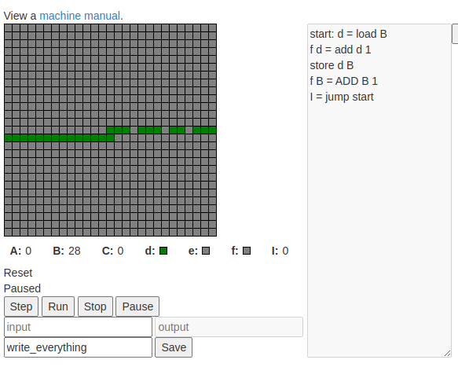

Hack-A-Day is a project I'm doing in November, where I try to make 30 new projects, in 30 days.

# Day 10: Hack-A-Machine

This is a whimsical virtual machine. Edit and run programs to do what you like. Share programs with friends.



Demo available at [here](https://tilde.za3k.com/hackaday/machine).

Source available on [github](https://github.com/za3k/day10_machine).

Note! There is a bug where you need to save before running a program.

Good luck! I don't accept bug reports, but I do accept pull requests.

## Signed Trinary

The machine operates in "signed trinary". A **WORD** is made up of six **trits**, or signed trinary bits. A trit can be +1, 0, or -1. WORDs can range from -364 to +364.

For example:
- 0 is written as 0, 0. (0 + 0 = 0)
- 1 is written as 0, 1. (0 + 1 = 1)
- 2 is written as 1, -1. (3 + -1 = 1)
- 3 is written as 1, 0. (3 + 0 = 3)
- 4 is written as 1, 1. (3 + 1 = 4)
- 5 is written as 1, -1, -1 (9 + -3 + -1 = 5)
- -5 is written as -1, 1, 1 (-9 + 3 + 1 = -5)

Addition, subtraction, multiplication, comparison, and trit-shifting are easy in this representation. It has many advantages over binary, in fact.

## Registers

The machine has six registers. Registers are case-sensitive.

- **A**, **B**, and **C** are WORD-sized registers
- **d**, **e**, and **f** are trit-sized registers
- **I** is the instruction pointer, which can hold any size up to the size of the program. The instruction pointer is automatically incremented. The program halts if it auto-increments past the end.

## Memory

The machine has 729 trits of memory, addressed from -364 to +364.

## Interface

On the right, there is a text box to edit your program. On the left, memory is displayed as a square grid. Under the memory is shown the values of the six registers, the current instruction being executed, and the state of the machine (reset, running, paused, or stopped).

Finally, there is a box for input and output. Input can only be read once, and output is only written once.

In addition, memory can be used as a screen. Write appropriate values to it to display pictures. Memory also acts as a "touchscreen" input device. Click any cell to zero it.

## Example program

The following program 
```
start: d = load B
f d = add d 1
store d B
f B = ADD B 1
I = jump start
```

## Labels

In the instruction

``start: d = load B```

**start:** indicates the line has a label called *start*. 

Later, you can jump to labeled lines, as with

```I = jump start```

## Operators

The machine has 21 operators (plus 3 aliases). Each operator takes the following form:

```f B = ADD B 1```

This instruction **ADD**s together the contents of WORD-register **B** and the constant value **1**. It puts the main result in WORD-register **B***, and sets trit-register **f** to hold any overflow.
All operators have a fixed number of inputs and outputs, of fixed size. 

Below they are shown as 

- W (for WORD-size)
- t (for trit-size)
- L (for a hardcoded label)
- I (for jumps, which always place their result in the instruction pointer)

It is always okay to put in a trit in something expecting a WORD. It's never okay to put a WORD in something expecting a trit--a compile-time error will result.

Here is a complete list of operators (not all tested yet!)

1. `t = RIGHT W`: Copies the rightmost (least significant) trit of the WORD
2. `W = RSHIFT W`: Shift the entire WORD one trit right, placing 0 on the left side.
3. `W = LSHIFT W`: Shifts the entire WORD one trit left, placing 0 on the right side.
4. `t = CMP W W`: Compares two words. Outputs -1 if the one on left is lesser, 0 if they are equal, or 1 if the one on the left is greater.
5. `t t = add t t`: Adds two trits, with overflow.
6. `t W = ADD t W`: Adds two WORDs, with overflow.
7. `W = MUL W t`: Multiplies a WORD by a trit.
8. `t = mul t t`: Multiplies two trits.
9. `W = MOV W`: Copies a WORD.
10. `t = mov t`: Copies a trit.
11. `store t W`: Store the trit at the given address
12. `t = load W`: Loads the trit from the given address
13. `I = jump L`: Unconditional jump
14. `I = jz t L`: Jump if zero.
15. `I = jp t L`: Jump if positive.
16. `I = jn t L`: Jump if negative.
17. `I = je t L`: Jump if equal (use after CMP).
18. `I = jg t L`: Jump if greater than (use after CMP).
19. `I = jl t L`: Jump if less than (use after CMP).
20. `t = random`: Generate a random trit
21. `halt`: Stop the machine
22. `flush`: (not implemented) in fast mode, do a visual screen update
23. `W t = IN`: Read one byte of input as an ascii character code. Also returns a trit indicated end-of-input (1 if yes, 0 if no).
24. `OUT W`: Write one byte of input (an ascii character code). To terminate output, call `halt`.
